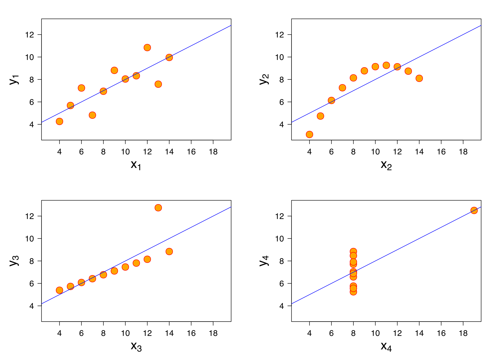

```{r setup, include=FALSE}
knitr::opts_chunk$set(eval = TRUE,
                      echo = TRUE,
                      message = FALSE, 
                      warning = FALSE)
```


# Data Visualization with ggplot2 

Learning Outcomes:
- Use the capabilities of ggplot2.
- Apply basics of data visualization.

### What's in a name?

- Charts, Plots, Maps, Graphs, Graphics, Diagrams, Infographics, ...
- Different perspectives on the definitions in different fields
- We will consider plots and graphs or (plotting and graphing) as synonyms
- Our focus is on depicting data from a mathematical and visual perspective  

    ```{r, echo=FALSE, fig.cap="Napoleon's Invasion of Russia 1812-13", out.width = '100%'}
    
    ```

@noauthor_charles_2019

\newpage
## Plotting in R

### Three main plotting systems in R:
- [base R](https://dcgerard.github.io/stat_412_612/lectures/03_images/03_base_r_cheatsheet.pdf)
- [lattice](https://dcgerard.github.io/stat_412_612/lectures/03_images/03_lattice_cheatsheet.pdf), and  
- [ggplot2](https://www.rstudio.com/resources/cheatsheets/#ggplot2) (from the tidyverse)
  + [`qplot()`](https://dcgerard.github.io/stat_412_612/lectures/03_images/03_qplot_cheatsheet.pdf) is a function in the ggplot2 package with simple syntax useful for *quick plots*.  

- Base R: Use a plotting function to create a blank plot object and add individual elements one-by-one till complete --- the "artist's canvas".
- lattice: Use one function to specify everything at once.
- ggplot2:  Use multiple functions to create layers following the grammar of graphics.
  + The layers map variables (data) to aesthetic attributes (size, color, shape) to be assigned to geometric objects (lines, bars, points).

### Examples
- Three ways to make a scatterplot with a loess smoother and a rug plot.

- Load the packages and built in `mpg` data:
    ```{r, messages = FALSE}
    library(ggplot2)
    suppressMessages(library(dplyr))
    library(lattice)

    data("mpg")
    ```


#### **Base R**:
- Everything is a separate non-connected function
    ```{r, fig.width = 6, fig.height = 4}
        ## Make a scatterplot
        plot(x = mpg$displ, y = mpg$hwy, xlab = "Displacement", ylab = "Highway")

        ## Add loess curve
        lout <- loess(hwy ~ displ, data = mpg)
        ord_x <- order(lout$x)
        lines(lout$x[ord_x], lout$fitted[ord_x])

        ## Add two rug plots
        rug(mpg$displ, side = 1)
        rug(mpg$hwy, side = 2)
    ```


#### **lattice**:
- Everything is done at once within one mega-function:
    ```{r, fig.width = 6, fig.height = 4}
        xyplot(hwy ~ displ, data = mpg,
               xlab = "Displacement", ylab = "Highway",
               panel = function(x, y) {
                 panel.xyplot(x = x, y = y)                   ## Add scatterplot
                 panel.loess(x = x, y = y, span = 0.75,
                             family = "gaussian", degree = 2) ## Add loess curve
                 panel.rug(x = x, y = y)                      ## Add rug plot
               })
    ```


#### `ggplot2` Package:
- Many connected functions using consistent names and syntax
    ```{r, fig.width = 6, fig.height = 4}  
        ggplot(mpg, mapping = aes(x = displ, y = hwy)) + ## map data to aesthetics
          geom_point() +                                 ## apply aesthetics to
                                                         ##   point objects
          geom_smooth(se = FALSE, method = loess) +      ## add smoothing objects
          geom_rug() +                                   ## add rug objects
          xlab("Displacement") +
          ylab("Highway")
    ```

#### Tradeoffs
- Base R is very flexible.
  + It has many default plots for quick views, e.g., plotting several views of the residuals from a model
  + It is hard to learn about to change many of the defaults to create "public" plots.
- 'lattice' is the hardest to learn
  + Plots are slightly more presentable
  + It is also the least used.
- The 'ggplot2' package is relatively easy to use for most tasks since it works well with other tidyverse packages
  + The default plots are better looking
  + There are many extensions to ggplot2 with a variety of themes and specialized plots
- All of the approaches require creativity and in-depth work if you want to do something unusual
  + If no package has done it before, time to create your own plotting function if you want to change a lot of defaults

- Regardless of the approach, we will be plotting for analysis and to communicate to others
  + Avoid adding gratuitous elements that can distract the viewer
  + Minimize redundant information that can confuse the viewer

## Why Create Graphics for Exploratory Data Analysis ?
- **Numbers never tell the whole story with data sets!**

### Anscombe


- All the graphs are based on data with the same summary statistics!\
@anscombe_graphs_1973-1


### The "DatasauRus Dozen" Package

- More examples of data sets with nearly identical summary statistics
- Find the T-Rex!

    ```{r, fig.height = 3, fig.width  = 5, message = FALSE}
    library(datasauRus)
    datasaurus_dozen %>%
      group_by(dataset) %>%
      summarize(
        mean_x    = mean(x),
        mean_y    = mean(y),
        std_dev_x = sd(x),
        std_dev_y = sd(y),
        corr_x_y  = cor(x, y)
      )
    ```

    ```{r, fig.height = 4.5, fig.width  = 6.5, eval = TRUE}
          ggplot(datasaurus_dozen, aes(x=x, y=y, color=dataset))+
            geom_point(size = .5)+
            theme_void()+
            theme(legend.position = "none")+
            facet_wrap(~dataset, ncol=3)
    ```
@noauthor_datasaurus_nodate      

##  The 'ggplot2' package

### Foundational Concepts Underlying the ggplot2 Package

- The ggplot2 package is based on a set of concepts called the "Grammar of Graphics" (GoG)
- The grammar of graphics is an architectural approach to creating graphs
- The GoG emphasizes *modularity through layers* so users can create better graphics more easily
- The GoG is structured to enable transparency, maintainability, and reproducibility.  

- When you installed the tidyverse packages, it included the ggplot2 package
  + If you did not install the tidyverse, do it now using the console (`install.packages("tidyverse")`)
  - Let's load the tidyverse
    ```{r}
    library(tidyverse)
    ```

- Notice when you use `library(tidyverse)`, it loads the ggplot2 package, so no need to load it again.  

### Elements of the Grammar of Graphics
- The 'ggplot2' package uses functions to work with the following GoG elements:

  + **Data Frames** (`data`): Contains the variables that you want to plot.
  + **Aesthetic Mappings** (`mapping`): Assign variables to aesthetics (e.g. $x$-coordinate, $y$-coordinate, color, shape, transparency, line thickness, line type) of geometric objects.
  + Transformations (`stat`): Transforms data into a new data frame for plotting
    - e.g. calculating (and then plotting) the number of observational units in each bin for a histogram.
  + **Geometric Objects** (`geom`): The type of plot you want (e.g. scatterplot, line plot, histogram, barplot)
  + Position Adjustments (`position`): Jitter objects, overlap histogram bins, etc..
  + **Facets**: Create multiple plots, one for each value of a categorical
variable.
  + Coordinate systems: Cartesian/polar

- The GoG approach works with the elements as individual layers in building or creating a graph.

   @wickham_layered_2010
- You can get most of your plotting work done by manipulating four elements:
  + data frames - the input data
  + aesthetic mappings - where things go and what they look like, ... created using `aes()`
    - See help for aesthetic and look at the vignette for ggplot2: ggplot2-specs
  + geoms - type of plot geometry, e.g., point, bar, column, hex, ..., created using `geom_*()`, and
  + facets - creating multiple graphs using `facet_grid()` or `facet_wrap()` to show an additional dimension of the data
- We won't modify the other GoG elements too often.

### The `ggplot()` function is the Workhorse of ggplot2
- The `ggplot()` function creates the blank `gg` object - the canvas.
- It has two main arguments:
  + `data`: *Must be a data frame*. Contains the variables that you want to map to aesthetics.
  + `mapping`: Specifies which variables map to which aesthetics.
    - Aesthetics may include: data to go on the x axis, data to go on the y axis, color, shape, fill, transparency, ...
    - You almost always use the `aes()` function to perform this mapping.

- Let's create a graph using `ggplot()`.
  + Let's define the data as the built in `mpg` data frame - look at help for `mpg`
  - Let's use `aes()` to map the `displ` variable to the `x` axis and the `hwy` variable to the `y` axis.

    ```{r, echo = TRUE, eval = TRUE}
    ggplot(data = mpg, mapping = aes(x = displ, y = hwy))
    ```

- Oops! There are no points showing on the graph?  Why?
  + We didn't add the geom_element to the layer!

- To *add another element* to the layer, we use a `+` sign
- `ggplot()` is almost always followed by a space and then a `+` and then on the next line, we can add a `geom_*()` function
  + **Make sure the `+` is at the end of a line and not at the beginning of a line.**
- The `*` in the `geom_*()` function is replaced by a name which specifies which geometric objects receive the aesthetic mapping and should be shown.
  + The help for `geom_` shows many possible `geom_*()` functions
- Let's add a geom for a scatter plot:
    ```{r, echo = TRUE, eval = TRUE}
    ggplot(data = mpg, mapping = aes(x = displ, y = hwy)) +
      geom_point()
    ```
- Our plot looks much more useful now!

- We will now go through several different analytical situations and the types of geoms that are appropriate for each situation.

## Comparing Two Quantitative Variables

### Scatterplots: `geom_point()`

- Scatterplots (or point plots) explore the relationship between two **quantitative** variables.
- "Quantitative" variables are numeric variables where at least one arithmetic operation ($+/-/\times/\div$) makes sense.
  + E.g. `hwy` and `displ` are two quantitative variables as you can add and subtract them.
  + Not all variables with numbers are quantitative (e.g. phone numbers).
  + Not all operations make sense on quantitative variables, e.g., multiplying two temperatures

- After creating the `gg` blank canvas and mapping, use `+` to add a `geom_point()` to create a scatterplot:
  + Use `ggplot()` to create the `gg` object and the aesthetic mapping using `aes()`
  + Map `displ` onto the `x` aesthetic and `cty` onto the `y` aesthetic.
  + Hit enter after the `+ and note the indentation, then,
  + Add `geom_point()`
    ```{r}
    mpg %>% ggplot(mapping = aes(x = displ, y = cty)) +
      geom_point()
    ```

- This plot indicates a **negative** relationship between `displ` and `cty` - as `displ` increases, `cty` decreases

- The following indicates a **positive** relationship between `hwy` and `cty`

    ```{r}
    ggplot(data = mpg, mapping = aes(x = cty, y = hwy)) +
      geom_point()
    ```
- Notice: it is our choice as to which variables maps to the `x` axis and which maps to the `y` axis.
- Typically the *Response variable* goes on the `y` axis and the potential *Explanatory variable* go on the `x` axis
  + Plot Variable A "**vs**" Variable B usually means *map Variable 2 to the `x` axis and Variable 1 to the `y` axis*
  + Plot A as "**a function of**" B usually means *map Variable 2 to the `x` axis and Variable 1 to the `y` axis*
- Changing the mapping does not change the nature of the relationship but can change how most people will interpret your plot as to which variable might be explaining or affecting or associated with the other variables values.
    ```{r}
    ggplot(data = mpg, mapping = aes(x = hwy, y = cty)) +
      geom_point()
    ```

### Adding a Third Dimension by Coding (or Annotating) by a Categorical Variable

- We might be interested in looking at the association of two quantitative variables based on *different values of a categorical variable*.

- A **categorical** variable characterizes observational units based on membership in different groups or categories
  + Categorical variables have limited number of distinct values or levels.
  + Examples might include Eye color, Hair color, Religion, Country, or
  + The `mpg` data set has `drv` as a categorical variable with three levels for the the type of drive train: where f = front-wheel drive, r = rear wheel drive, 4 = 4 wheel drive

- We can map categorical variables to multiple aesthetics: e.g., `color` (better) or `shape` (worse)
- Since Categorical variables have limited numbers it's often easy to distinguish the levels
- When you get into more than 10, say if you were using the 50 States, the colors can get hard to distinguish
- Example of mapping a categorical variable to the Color aesthetic
    ```{r}
    ggplot(data = mpg, mapping = aes(x = displ, y = hwy, color = drv)) +
          geom_point()
    ```
- Example of mapping a categorical variable to the Color aesthetic   
    ```{r}
    ggplot(data = mpg, mapping = aes(x = displ, y = hwy, shape = drv)) +
          geom_point()
    ```
- Example with 50 states - try to find another way to categorize
    ```{r}
    library(datasets)
    data.frame(state.x77) %>%
      rownames_to_column(var = "State") %>%
      ggplot(aes(x = Population, y = Income, color = State)) +
      geom_point()
    ```

#### Exercises:
1. What happens when you map a categorical variable to the `size` or `alpha` aesthetics?


2. Load the `iris` dataset that comes with R by default and look at the first 6 rows of data.  
- What are the variables and what type are they?


3. Make a scatterplot plot of petal length vs petal width and color code by the species. What do you notice?


### Adding a Third Dimension by Coding (or Annotating) by a Quantitative Variable

- If we want to look at the association between two quantitative variables at different levels of a third quantitative variable, we can map that third quantitative variable to an aesthetic as well.
- There are three main choices: `color` (good), `alpha` (good), or size (worst unless points have minimal overlap).

- Coding by color - gives a smear or spectrum of colors,
    ```{r}
    ggplot(data = mpg, mapping = aes(x = displ, y = hwy, color = cty)) +
              geom_point()
    # Example using the viridis package to change the color scale
        ggplot(data = mpg, mapping = aes(x = displ, y = hwy, color = cty)) +
              geom_point() +
          viridis::scale_color_viridis()
    ```
- Coding by alpha (for transparency)
    ```{r}
    ggplot(data = mpg, mapping = aes(x = displ, y = hwy, alpha = cty)) +
              geom_point()
    ```
- Coding by size, often called a "bubble chart"
    ```{r}
    ggplot(data = mpg, mapping = aes(x = displ, y = hwy, size = cty)) +
                  geom_point()
    ```

#### Exercise

1. What happens when we map a quantitative variable to the `shape` aesthetic?

    ```{r, error = TRUE}
    ggplot(data = mpg, mapping = aes(x = displ, y = hwy, shape = cty)) +
                  geom_point()

        ## We get an error - R has a limited number of shapes to draw from
    ```

### Multiple mappings can lead to sensory overload

- We can map multiple variables to multiple aesthetics at the same time, but the resulting plot might get too complicated to be useful.

    ```{r}
    ggplot(data = mpg,
           mapping = aes(x = displ,
                         y = hwy,
                         alpha = cty,
                         shape = drv,
                         color = class)) +
      geom_point()
    ```

#### Exercise

1. Using the `iris` dataset, plot petal length vs petal width, coding by sepal length, sepal width, and species. Do you notice anything?

    ```{r}
    ggplot(data = iris, mapping = aes(x = Petal.Length,
                                      y = Petal.Width,
                                      color = Species,
                                      size = Sepal.Length,
                                      alpha = Sepal.Width)) +
      geom_point()


    ## Virginica appears to have larger sepal length.
    ## But the plot is too cluttered to make anything else out.
    ```


### Smoothing: `geom_smooth()`
- Using a smoothing lines is often helpful to see if there is a potential relationship between variables
- `geom_smooth()` will create trend lines (either linear or locally curved) and plot these.
- The curve is the default "method". So is showing gray bands for the standard errors ("se")  

    ```{r}
    ggplot(data = mpg, mapping = aes(x = displ, y = hwy)) +
              geom_smooth()
    ```
- The standard errors can clutter up the chart so we often turn them off using `se = FALSE`
    ```{r}
    ggplot(data = mpg, mapping = aes(x = displ, y = hwy)) +
              geom_smooth(se = FALSE)
    ```   

#### Coding by Categorical Variable
- If you are coding by a categorical variable, `geom_smooth()` will create a line for each level based and use the mapped aesthetic.
- Choices include: `color` (best) or `linetype` (good) aesthetics

    ```{r}
    ggplot(data = mpg, mapping = aes(x = displ, y = hwy, color = drv)) +
              geom_smooth(se = FALSE)
    ```

    ```{r}
    ggplot(data = mpg, mapping = aes(x = displ, y = hwy, linetype = drv)) +
              geom_smooth(se = FALSE)
    ```

#### Smoothing Methods
- The default for `geom_smooth()` is to calculate a curve (a polynomial *loess smoother* (see help)), but other options are available.
- We can plot the Ordinary Least Squares (OLS) linear regression fit by changing setting the `method` argument to `method = lm` for linear model.

    ```{r}
    ggplot(data = mpg, mapping = aes(x = displ, y = hwy)) +
          geom_point() +
          geom_smooth(se = FALSE, method = lm)
    ```

- If you have *binary response data* (Yes, No), you can plot fitted logistic curves by setting the method and family
    ```{r}
    ggplot(data = mtcars, mapping = aes(x = hp, y = vs)) +
      #vs is engine shape (0 = V or 1 = straight)
      geom_point() +
      geom_smooth(method = glm, method.args = list(family = "binomial"), se = FALSE)
    ```

### Layering Geoms:

- You can add multiple layers of geoms that use the same data and aesthetic map as defined in the `ggplot()` call.
    + *`ggplot()` passes all the mappings in the `ggplot(aes(...))` to later functions as the default mappings*

    ```{r}
    ggplot(data = mpg, mapping = aes(x = displ, y = hwy)) +
      geom_point() +
      geom_smooth(se = FALSE)
    ```

- You can equivalently define the aesthetics in the particular geom you are using.
  + However, later geoms *will not have access to these mappings* and you would have to redefine them.
  + This is sometimes what you want to do.

    ```{r}
    ggplot(data = mpg) +
      geom_point(mapping = aes(x = displ, y = hwy))
    ```
- Example of what happens when there is no default mapping and you forget to to specify every mapping.
    ```{r, error = TRUE, eval = FALSE}
    ## Should produce an error
    ggplot(data = mpg) +
      geom_point(mapping = aes(x = displ, y = hwy)) +
      geom_smooth()
    ```

- Steps to differentiate the mappings for different geoms:
  + Place the aesthetic mappings you want as the default (to be shared) in the `ggplot(aes())` call.
  + Place geom-specific aesthetic mappings within the `geom_*(aes()` call
- Example of separate mappings so yo only get one smoothing line and not one per level of the categorical variable
    ```{r, error = TRUE}
    ggplot(data = mpg, mapping = aes(x = displ, y = hwy)) +
      geom_point(mapping = aes(color = drv)) +
      geom_smooth(se = FALSE)
    ```

#### Exercise
1. Create a scatterplot of petal length vs petal width.  
- Color the scatter plot code by species
- Add a single smoother line to show the linear regression between petal length and petal width without considering species.

    ```{r,  }
    ggplot(data = iris, mapping = aes(x = Petal.Length, y = Petal.Width)) +
      geom_point(mapping = aes(color = Species)) +
      geom_smooth(method = lm, se = FALSE)
    ```


### Reducing Overplotting of points

- Overplotting is when there is so much data with similar values the plotted points overlap or cover each other up to so it is hard to interpret the results.  
- The variables `cty` and `hwy` are rounded, so result in a lot of overlapping.

- Three ways to counteract this for a given type of plot:
  1. If you have a small data set, use `geom_jitter()` to have R change the values slightly in the x and y directions
  2. If you have a large data set, set the transparency (`alpha`) for all points to be low, e.g., 0.1.
  3. If you have a really large dataset, randomly sub-sample the observational units (chapter 5).

    ```{r}
    ggplot(data = mpg, mapping = aes(x = cty, y = hwy)) +
      geom_point() +
      ggtitle("Original")
    ```

    ```{r}
    ggplot(data = mpg, mapping = aes(x = cty, y = hwy)) +
      geom_jitter() +
      ggtitle("Using geom_jitter to adjust location") # +
    #geom_point(color = "red") +

    ```

    ```{r}
    ggplot(data = mpg, mapping = aes(x = cty, y = hwy)) +
      geom_point(alpha = 0.1) +
      ggtitle("Using alpha to adjust transparency")
    ```

#### Exercise
1. Use `data()` to load the `diamonds` dataset from ggplot2. Plot `price` vs `carat`. Account for overplotting if possible.

    ```{r,  }
    data("diamonds")
    ggplot(data = diamonds, mapping = aes(x = carat, y = price)) +
     geom_point() +
      ggtitle("Original")
    ggplot(data = diamonds, mapping = aes(x = carat, y = price)) +
     geom_point(alpha = 0.01) +
     ggtitle("alpha set to .01")
    ```

### Another Option is Create a 2-D Summary Using `geom_hex()`
- Also known as a *Hexagonal Heatmap*
- It breaks up the plot into regular hexagons (or bins) and measures the number of points in each hexagon
    ```{r}
    ggplot(data = diamonds, mapping = aes(x = carat, y = price)) +
     geom_hex(bins = 150) +
     ggtitle("Using geom_hex, bins = 150")

    # Example with fewer bins and viridis scale
    ggplot(data = diamonds, mapping = aes(x = carat, y = price)) +
     geom_hex(bins = 50) +
     ggtitle("Using geom_hex, bins = 50") +
     viridis::scale_fill_viridis()
    ```


## One Quantitative Variable

- We are often interested in understanding the shape of the distribution of a variable
- By distribution we mean what values does it takes and how often does it take each value.
- As an example, we want to see if the distribution is uniform, symmetric, or skewed (left or right), or, is it uni-modal (one hump) or bi-modal (two humps) or something interesting or unusual.

### Histograms: `geom_histogram()`

- A histogram is useful for exploring the distribution of a quantitative variable.
- `geom_histogram()` breaks up the range of the variables values into bins of equal width and then counts how many observations fall into each bin
- The bins fall along the `x` axis and the `y`-axis shows the counts for each bin" (automatically).
    ```{r}
    ggplot(data = mpg, mapping = aes(x = hwy)) +
      geom_histogram()
    ```
- The default for the number of bins is 30 but you can change that to get a plot that might be more meaningful.
- Play around with the `bins` argument until you get something useful or nice-looking.
- You can also set `binwidth` as an alternative, e.g., you want each bin to be exactly 5 units wide.

    ```{r}
    ggplot(data = mpg, mapping = aes(x = hwy)) +
      geom_histogram(bins = 20)

        ggplot(data = mpg, mapping = aes(x = hwy)) +
      geom_histogram(binwidth = 5)
    ```

### Adding a Second Dimension by Coding (Annotating) by a Categorical Variable

- Histograms have aesthetics you can use to code by a categorical variable

#### Adjusting the Color of the Bars
- You can adjust color with two options: `fill` (best) or `color` (worst).
  + `fill` adjusts the *interior color* of a shape and `color' adjusts the lines defining the shape
- The default presentation is a "stacked histogram" where the total counts per bin remain the same, but they are broken out by the chosen aesthetic within each bin

    ```{r}
    ggplot(data = mpg, mapping = aes(x = hwy, fill = drv)) +
      geom_histogram(bins = 20)
    ```

    ```{r}
    ggplot(data = mpg, mapping = aes(x = hwy, color = drv)) +
      geom_histogram(bins = 20)
    ```

#### Adjusting the Position of the Bars
- Stacked Histograms can be difficult to interpret as all but the bottom values have different starting points on the `y` axis.
- We can change the `position` argument of `geom_histogram()` to breakout the individual histograms within all levels of the categorical variable - so they are no longer stacked.
- `position = "identity"` moves all histograms to be based at the lowest value of the `y` axis. However that means they can cover each other up
- To see all histograms, changing the transparency of the histograms in conjunction with `position = "identity"`.

    ```{r}
    ggplot(data = mpg, mapping = aes(x = hwy, fill = drv)) +
      geom_histogram(bins = 20, position = "identity")
    ggplot(data = mpg, mapping = aes(x = hwy, fill = drv)) +
      geom_histogram(bins = 20,  position = "identity", alpha = 0.3)
    ```
- To put the histograms side by side, use `position = "dodge"` to separate the bins for each category.

    ```{r}
    ggplot(data = mpg, mapping = aes(x = hwy, fill = drv)) +
      geom_histogram(bins = 20, position = "dodge")
    ```
- To see relative proportions of counts, use `position = "fill"` to see the relative proportions of each category within a bin.
    ```{r}
    ggplot(data = mpg, mapping = aes(x = hwy, fill = drv)) +
      geom_histogram(bins = 20, position = "fill")
    ```


#### Exercise

1. Create a histogram of the price of a diamond, color coding by cut.

    ```{r,  }
    ggplot(data = diamonds, mapping = aes(x = price, fill = cut)) +
      geom_histogram(bins = 50)
    ```


### Density Plots: `geom_density()`

- A density is a "smoothed" histogram. It can be created with `geom_density()`
- Densities and histograms generally give us identical information.

    ```{r}
    ggplot(data = mpg, mapping = aes(x = hwy)) +
      geom_density()
    ```

- You can plot the densities for the different levels of a categorical variable by mapping the `fill` aesthetic

    ```{r}
    ggplot(data = mpg, mapping = aes(x = hwy, fill = drv )) +
      geom_density()
    ```

- You can change the transparency to see all densities.

    ```{r}
    ggplot(data = mpg, mapping = aes(x = hwy, fill = drv)) +
      geom_density(alpha = 0.3)
    ```


## One Categorical Variable and One Quantitative Variable.

### Box Plots - `geom_boxplot()`

- The Box Plot (or box and whiskers plot) is often the best way to visually assess the association between a categorical and a quantitative variable.
- A box plot is a compact representation of five summary statistics:
  + The median,
  + The 25^th^ and 75^th^ percentiles - known as the hinges, and used to calculate the Inter-quartile range (IQR),
  + Lower and Upper "whiskers" (up to 1.5* IQR above and below the median), and
  + All the "outlying" points - those points more than 1.5* IQR above/below the median.

- Use `geom_boxplot()` to create a boxplot.

    ```{r}
    ggplot(data = mpg, mapping = aes(x = drv, y = hwy)) +
      geom_boxplot()
    ```

- The boxplot does not show any details of where the internal points are within the box
- An alternative is a violin plot: `geom_violin()` which adds a density-style plot

    ```{r}
    ggplot(data = mpg, mapping = aes(x = drv, y = hwy)) +
      geom_violin()
    ```

- Another alternative is the beeswarm plot from the package ggbeeswarm. `ggbeeswarm::geom_beeswarm()`
    ```{r}
    library(ggbeeswarm)
    ggplot(data = mpg, mapping = aes(x = drv, y = hwy)) +
      geom_beeswarm()
    ```

### Changing Scales
- Many types of data can have skewed distributions where some values are much much larger than others.
- Common examples are salaries at large corporations, housing prices, radio-active decay times, ...
- A common technique to reduce the skew (and make distributions more symmetrical) is to work with the log of the data.
- There are two ways to do this when plotting.
  + The first is to use the `log()` function and map the `log(my_data)` to the desired axis aesthetic
    - Note: the default for `log()` is the natural logarithm with base $e$
    - There are other log functions e.g., `log10()`
    - These change the values on the transformed axis
  + When doing exploratory data analysis, the quick way is to adjust the scale of the axis in question
    - Use `scale_y_log10()` or `scale_x_log10()` to adjust how the plot looks without changing the data
    - This preserves the values of the variable (so not the same as `log(my_data)` but they not spread evenly,
    - The relationship will look the same as if you logged the data

- Example with Texas Housing Sales data where volume is the Total Value of Sales
    ```{r}
    txhousing %>%
      ggplot(aes(x = as.factor(year), y = volume)) +
      geom_boxplot()

      txhousing %>%
      ggplot(aes(x = as.factor(year), y = log(volume))) +
      geom_boxplot()

      txhousing %>%
      ggplot(aes(x = as.factor(year), y = volume)) +
      geom_boxplot() + scale_y_log10()
    ```


#### Exercise

1. Create a boxplot for log-price vs. cut.  
- Note: `cut` is the quality of the cut (Fair, Good, Very Good, Premium, Ideal)
- Does anything surprise you?
- Can you think of another plot that could explain your surprise?

    ```{r}
    ggplot(data = diamonds, mapping = aes(x = cut, y = price)) +
      geom_boxplot() +
      scale_y_log10()

    ## Ideal diamonds are lower priced?
    ```

    ```{r}
    ggplot(data = diamonds, mapping = aes(x = cut, y = carat)) +
      geom_boxplot() +
      scale_y_log10()
    ## But they also tend to be smaller diamonds.
    ```

## Facets

Facets are Another Way to Add Another Dimension with a Categorical Variable

- If you want to add another dimension with a categorical variable you can create multiple plots using `facet_wrap()` or `facet_grid()`.
- `facet_wrap()`is used with one categorical variable
- It creates a sequence of panels and wraps them around into a rectangle
    ```{r}
    ggplot(data = mpg, mapping = aes(x = displ, y = hwy)) +
      geom_point() +
      facet_wrap( ~ class)
    ```
- `facet_grid()` forms a matrix of panels defined by row and column faceting variables.
- It is most useful when you have *two categorical variables*.     
    ```{r}
    ggplot(data = mpg, mapping = aes(x = displ, y = hwy)) +
      geom_point(alpha = .3) +
      facet_grid(drv ~ class) # rows ~ cols
    ```
- You can use `facet_grid()` with one variable
- Use "." to show no faceting on either the or column dimension
- Example of no faceting on the columns
    ```{r}
    ggplot(data = mpg, mapping = aes(x = displ, y = hwy)) +
      geom_point() +
      facet_grid(class ~ .) # No faceting on the columns
    ```
- Example of no faceting on the rows
    ```{r}
    ggplot(data = mpg, mapping = aes(x = displ, y = hwy)) +
      geom_point() +
      facet_grid(. ~ drv)
    ```

#### Exercise
1. Create boxplots of price vs cut and then facet by color.

    ```{r}
    ggplot(data = diamonds, mapping = aes(x = cut, y = price)) +
      geom_boxplot() +
      scale_y_log10() +
      facet_wrap( ~ color)
    ```

## Other Types of Formatting

### Aesthetics for all objects.

- Suppose we like scatterplots with blue points. The correct code is:
    ```{r}
    ggplot(data = mpg, mapping = aes(x = displ, y = hwy)) +
      geom_point(color = "blue")
    ```
- Note: "blue" is in quotes; it's a character variable  

- **The `"blue"` must be outside of the `aes()` *call.** This tells ggplot2 to set the aesthetic manually, instead of using it as a mapping from a variable.
  + If you put `"blue"` inside of the `aes()` call, ggplot2 will assume you intend it as a categorical variable where every observational unit has the value `"blue"`.
  + This is a common error.

    ```{r}
    ggplot(data = mpg, mapping = aes(x = displ, y = hwy, color = "blue")) +
      geom_point()
    ```

- You can change the aesthetics for histograms as well to clearly differentiate the bins.

    ```{r}
    ggplot(data = mpg, mapping = aes(x = hwy)) +
      geom_histogram(bins = 25)
    ggplot(data = mpg, mapping = aes(x = hwy)) +
      geom_histogram(bins =25, fill = "white", color = "black")
    ```

### Use Themes to Change the Overall Style

- A gray background is nice for presentations, but bad for publications.

- `ggplot2` has a lot of themes you can use to reset multiple elements of the plot at once.
  + `theme_bw()` black and white, changes to a white background and is popular.

    ```{r}
    ggplot(data = mpg, mapping = aes(x = displ, y = hwy, color = class)) +
      geom_point() +
      theme_bw()
    ```

    ```{r}
    ggplot(data = mpg, mapping = aes(x = displ, y = hwy, color = class)) +
      geom_point() +
      theme_classic()
    ```

- Even more themes are available in the ggthemes package.

    ```{r}
    library(ggthemes)
    ggplot(data = mpg, mapping = aes(x = displ, y = hwy, color = class)) +
      geom_point() +
      theme_economist()
    ```

    ```{r}
    ggplot(data = mpg, mapping = aes(x = displ, y = hwy, color = class)) +
      geom_point() +
      theme_fivethirtyeight()
    ```

#### Exercise

1. Create a boxplot of price vs cut for each level of color.  
- Make the boxplots all orange and use the black and white theme.

    ```{r}
    ggplot(data = diamonds, mapping = aes(x = cut, y = price)) +
      geom_boxplot(fill = "orange") +
      scale_y_log10() +
      facet_wrap( ~ color) +
      theme_bw()
    ```

### Control the Scales for Different Elements of the Graph

- Scales control how a plot *maps data values to the visual values* of an aesthetic.
- To change the mapping, **add a custom scale**.

- The *scale* of the colors determines what color is the "largest" and which is the "smallest."

    ```{r}
    ggplot(data = mpg, mapping = aes(x = displ, y = hwy, color = cty)) +
      geom_point() +
      scale_color_continuous(low = "black", high = "white")
    ```

- The scale of an axis (log vs normal)

    ```{r}
    ggplot(data = diamonds, mapping = aes(x = carat, y = price)) +
      geom_point(alpha = 0.01) +
      scale_y_log10() +
      scale_x_log10()
    ```

## Colorblind safe palettes

- When you publish, it's polite to use colorblind safe palettes. You can do this easily with the `ggthemes` package.
- Use `scale_color_colorblind()` to change the scale of the `color` aesthetic.
- Use `scale_fill_colorblind()` to change the scale of the `fill` aesthetic, etc...

    ```{r}
    ggplot(data = mpg, mapping = aes(x = displ, y = hwy, color = class)) +
      geom_point() +
      theme_bw() +
      scale_color_colorblind()
    ```


    ```{r}
    ggplot(data = mpg, mapping = aes(x = hwy, fill = drv)) +
      geom_histogram(position = "dodge", bins = 15) +
      theme_bw() +
      scale_fill_colorblind()
    ```

- A popular alternative is the **viridis** package. It has a number of color scales designed to be:

  + **Colorful**, spanning as wide a palette as possible so as to make differences easy to see,
  + **Perceptually uniform**, meaning values close to each other have similar-appearing colors and values far away from each other have more different-appearing colors, consistently across the range of values,
  + **Robust to colorblindness**, so the above properties hold true for people with common forms of colorblindness, as well as in gray-scale printing
- You can install the package and use its functions such as you saw before
  + `scale_color_viridis_*d*()` or `scale_fill_viridis_*()`
  + replace `*` with`d` for discrete data, `c` for continuous data

    ```{r}
    ggplot(data = mpg, mapping = aes(x = hwy, fill = drv)) +
      geom_histogram(position = "dodge", bins = 15) +
      theme_bw() +
      scale_fill_viridis_d()
    ```

## Labels: Main, Axes, Legends

- Change axis labels manually with `xlab()` and `ylab()`.

- Add Titles with `ggtitle()`.

- **Modify Legend titles using a scale argument**.

    ```{r}
    ggplot(data = mpg, mapping = aes(x = displ, y = hwy, color = class)) +
      geom_point() +
      theme_bw() +
      scale_color_colorblind(name = "Car Class") +
      xlab("Displacement") +
      ylab("Highway") +
      ggtitle("Displacement vs Highway")
    ```

- If you don't want colorblind scale, you can use `scale_color_discrete()` or `scale_fill_discrete()` or `scale_color_continuous()` or `scale_fill_continuous()`  etc...

    ```{r}
    ggplot(data = mpg, mapping = aes(x = displ, y = hwy, color = class)) +
      geom_point() +
      theme_bw() +
      scale_color_discrete(name = "Car Class") +
      xlab("Displacement") +
      ylab("Highway") +
      ggtitle("Displacement vs Highway")
    ```

## Saving Plots: `ggsave()`

- A plots is an R object so you can save it to a variable name just like anything else.
- This is sometimes helpful when writing functions with plots or creating flexibility in what happens with a plot.

- To save a plot, you can either print it and then use the R Studio functionality.

    ```{r}
    ggplot(data = mpg, mapping = aes(x = displ, y = hwy, color = class)) +
      geom_point() +
      theme_bw() +
      scale_color_colorblind() ->
      pl
    ```
- Enter `pl` in the console to see the plot in the plots tab. Use the Export menu button to output as a file.   

- You can automate this process in your .Rmd file by using the `ggsave()` function
  + **Warning** `ggsave()` overwrites without asking by default
    ```{r}
    ggsave(filename = "my_first_plot.png",
           plot = pl,
           width = 6,
           height = 4,
           family = "Times")
    ```

- You can also do this manually using `pdf()`:
    ```{r, eval = FALSE}
    pdf(file = "my_second_plot.pdf", width = 6, height = 4, family = "Times")
    print(pl)
    dev.off()
    ```

  + `pdf()` opens up a connection to a new pdf file.
  + `print(pl)` prints the saved `gg` object to that pdf file (instead of the R graphics device).
  + `dev.off()` closes the connection.

#### Exercise

1. Create a boxplot of price vs cut  for each level of color.  
- Make the boxplots all orange and use the black and white theme.
- Save this plot to the output folder using `ggsave()`.

    ```{r eval = FALSE}
   pl <- ggplot(data = diamonds, mapping = aes(x = cut, y = price)) +
      geom_boxplot(fill = "orange") +
      scale_y_log10() +
      facet_wrap( ~ color) +
      theme_bw()
      
  ggsave(filename = "images/box_cut_price_color.pdf", plot = pl)
    ```

## Learning Outcomes Review

- Use the capabilities of ggplot2.
  + `ggplot()` and `aes()` for mapping data to aesthetics
  + Choosing and adding "geoms" to display data
  + Adjusting individual plots or creating multiple plots
  + Reducing Overplotting
  + Adjusting formatting: Color Themes, Titles, Scales

- Apply basics of data visualization
  + Scatterplots - Two quantitative
  + Histograms and Density Plots- One quantitative
  + Boxplots - One Quantitative and One Categorical
  + Coding by a categorical variable
  + Smoothing (loess and OLS)

## Lecture Code
Will be uploaded after the lecture


## References
- Chapter 3 [RDS](https://r4ds.had.co.nz/).
- [Data Visualization Cheat Sheet](https://github.com/rstudio/cheatsheets/blob/master/data-visualization-2.1.pdf).
- [Ggplot2 Overview](https://ggplot2.tidyverse.org/).

## Lab

## Homework Assignment  
